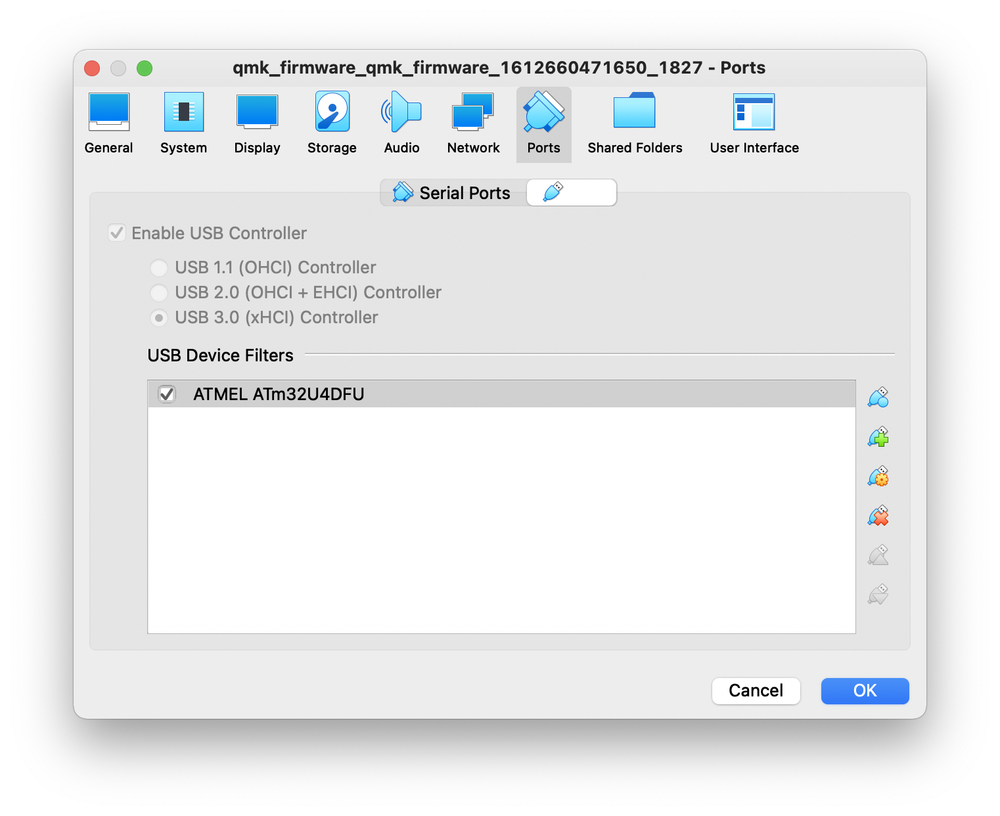
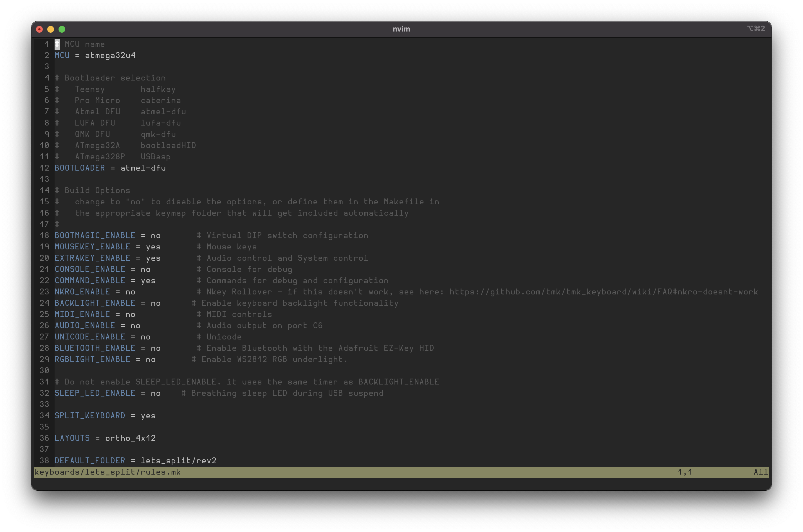
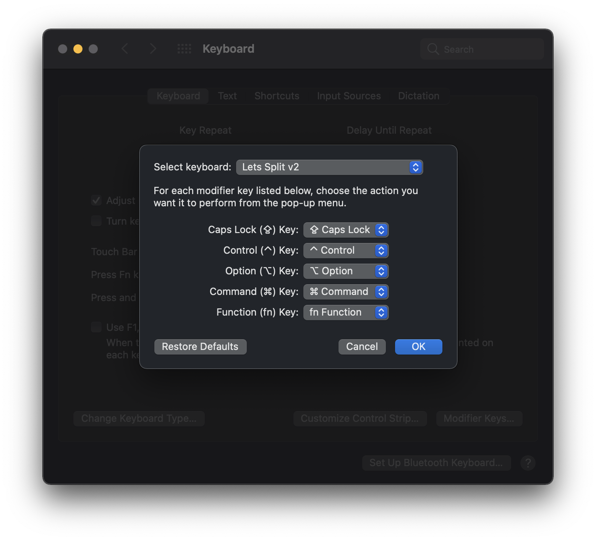

For going on three years now I've been a faithful [ErgoDox EZ](https://ergodox-ez.com/) user and evangalist. 


At first I didn't understand why I would possibly want to spend several hundred dollars on keyboard _parts_ and then still have to put them all together using several hundred dollars worth of tools, when I could spend the same amount (or realistically, less) and get a pre-made solution that works out of the box. But, as time has passed, my opinions on the ideal keyboard layout have grown gradually stronger (as I assume they tend to once you start using a programmable keyboard), and I'm finding myself wishing for configurations that aren't offered in a commercially manufactured keyboard. Namely, I'm plagued by two opinions which are inconvenient when held in tandem: firstly, that the ErgoDox has _too many keys_; and secondly, that split keyboards are _intrinsically superior_ to traditional keyboards. Since there aren't any commercially available split mechanical keyboards with substantially fewer keys than the ErgoDox (to my knowledge at least), this meant that to scratch this itch I was going to have to seek out a custom solution. I've always found the [Planck](https://olkb.com/collections/planck) keyboard to be an aesthetically pleasing keyboard---something about its symmetry and uniformity speaks to me, and it does away with the useless top row and 1u thumb cluster keys that plague the ErgoDox (seriously who uses these and what do their thumbs look like?)


So when I found out that there existed a split version of the Planck called the Let's Split, I knew it was the one. Maybe not the one forever, but at least be the one I want to build first (I can already tell this is going to be a rabbit hole).

Having explained all that, here is a list of the requirements I was hoping to meet with this build:

- Split keyboard
- About 40% size (QWERTY keys plus an outer row on each side and a bottom row---48 keys)
- Quiet(er) operation (to facilitate working in coffee shops/coworking spaces post-COVID)
- Robust enough to throw in a backpack
- USB-C port for easy MacBook compatibility
- Either side can act as primary (plugging the right or left half into the computer both work)

## Build Notes

For the most part I followed the very well-done Let's Split [build guide](https://github.com/nicinabox/lets-split-guide), with a few notable exceptions. Instead of using the open sandwich case prescribed in the guide, I chose to use the closed sandwich design available [here](https://github.com/nooges/lets-split-v2-case), to improve the backpack-robustness factor. One important note on this point---in order to use a case material that is not the same on both sides (I used matte clear acrylic, which only has a matte finish on one side) I used the modified design from [this PR](https://github.com/nooges/lets-split-v2-case/pull/3), which flips half of the top and bottom plates---otherwise one side of the keyboard will be smooth side facing out, and the other side will have the matte side facing out. The other change I made was to use the [Elite-C v4](https://www.reddit.com/r/MechanicalKeyboards/comments/9qguhx/news_announcing_the_elitec_a_better_pro_micro/) instead of the [Pro Micro](https://www.sparkfun.com/products/12640), because my desire for USB-C was stronger than my desire to not spend 2x as much money on microcontrollers. I also have not soldered since college so I am relearning it for this project, so it may not be the prettiest (I'm writing this ahead of the assembly, so we'll find out together). I'm using leaded solder because I've heard it's easier to work with as a beginner, and I plan to just do a thorough desk cleaning post-assembly.

## Parts List


- Case (linked in previous section)
- [PCB](https://spacecat.design/collections/pcbs-cases-kits/products/lets-split-pcbs)
- [Elite-C v4](https://keeb.io/products/elite-c-low-profile-version-usb-c-pro-micro-replacement-atmega32u4) x 2
- [1N4148 Diodes](https://www.digikey.com/products/en?keywords=1N4148FS-ND) x 100
- [TRRS Jacks](https://www.digikey.com/product-detail/en/cui-inc/SJ-43514/CP-43514-ND/368146) x 2
- [Boba U4 Silent Tactile Switches 68g](https://www.rgbkb.net/products/rgb-silent-tactile-switch?variant=37403073740952) x 48
- [10mm M2 Standoffs](https://keeb.io/products/m2-screws-and-standoffs) x 18
- [6mm M2 Hex Button Head Screws](https://www.amazon.com/gp/product/B07ZH6GRK2) x 36
- [Rubber Feet](https://www.amazon.com/gp/product/B06XPWD7VQ) x 8
- [Keycaps](https://www.amazon.com/gp/product/B07RKFZM7H)
- [24 AWG Wire](https://www.amazon.com/gp/product/B071CVSXJZ)
- [LED Strip](https://www.amazon.com/gp/product/B01CDTEG1O)
- [Switch Lube](https://dangkeebs.com/products/tribosys-3203) (if you're into that sort of thing)
- USB-C and TRRS cables
- Assorted tools and supplies (soldering stuff, switch opener, lube brushes, etc...)

## Assembling the Case

I did this first as a test fit because it got here first and I'm impatient. There is a ton of plastic backing that needs to be peeled off, which sounds fun but in reality is frustrating and really messed up my finger nails. 


The approach I took was to fasten the standoffs to the top plate and then stack the middle layers onto that, before attaching the bottom layer.


In retrospect I probably should have fastened them to the bottom plate first instead, since I'll have to take the top plate off for assembly, and that will be difficult to do since the standoffs won't be anchored to the bottom plate and will turn freely. Live and learn I suppose.

## Flashing

I found out while trying to build the firmware that QMK depends on the `qmk` CLI tool, which can only be installed via Homebrew, which I don't use (I'm a MacPorts guy). Some cursory searching indicated that Homebrew and MacPorts don't play nice when coinstalled, so I decided to avoid going that route. My next thought was to use Docker to do the install, but lo, Docker for Mac can't access the system USB ports without a [tedious workaround](https://dev.to/rubberduck/using-usb-with-docker-for-mac-3fdd), so that idea also went out the window. Bad Idea #3 was to install Linux via Boot Camp---turns out that is also tedious and error-prone (I'm starting to see a trend). Finally, I decided that the answer was to use a solution I haven't reached for in years: an actual VM managed via [Vagrant](https://www.vagrantup.com/). QMK [actually supports this](https://beta.docs.qmk.fm/using-qmk/guides/development-environments/getting_started_vagrant), so it wasn't too bad to get setup. Just install Vagrant and [VirtualBox](https://www.virtualbox.org/), fiddle with the necessary macOS Security & Privacy settings (I had to press "Allow" for apps from Oracle on the main screen, and enable Full Disk Access for iTerm), restart, and we're good to go. We'll also need the [VirtualBox Extension Pack](https://www.virtualbox.org/wiki/Downloads) in order for the VM to access the computer's USB ports.

The Elite-C v4 comes with the Atmel DFU bootloader preinstalled, so we'll need to target that with our QMK `make` command. The following steps are gleaned from the QMK [Flashing](https://beta.docs.qmk.fm/using-qmk/guides/flashing/flashing#atmel-dfu) and [Split Board](https://beta.docs.qmk.fm/using-qmk/hardware-features/feature_split_keyboard) docs, which you may want to refer to since this may be out of date by the time you read it. 

First we'll need to fork the QMK repo and clone it locally. Then navigate into the top-level directory of the repo, and start the VM:

```
# On host machine in ~/qmk_firmware
$ vagrant up
```

It will take some time, especially on the first boot, but eventually a blurb from QMK will appear about how to use the VM, meaning the machine has been provisioned. If this is the first time booting the machine, it will likely be necessary to open VirtualBox and manually enable USB on the VM. To do so, first stop it by running:

```
# On host machine in ~/qmk_firmware
$ vagrant halt
```

Then navigate to the halted machine in VirtualBox, and add the USB device by doing the following: right click -> Settings -> Ports -> USB; select USB 3.0; click the `+` icon on the box below; select the ATMEL ATm32U4DFU device; and save the settings. 



Then restart the VM by running `vagrant up` again. Once the machine has restarted with USB access, we'll need to SSH into it in order to build and flash the firmware. To do so, run:

```
# On host machine in ~/qmk_firmware
$ vagrant ssh
```

Following this we'll navigate into the VM's shared drive, which is where the `qmk_firmware` directory will be mounted, by running:

```
# On VM
$ cd /vagrant
```

Next I tried to just flash the firmware, but I got some error messages indicating that my git repository was missing some necessary submodules. To remedy this, run the following command (this should only be necessary the first time, since the changes will be persisted on the host machine via the mounted folder):

```
# On VM in /vagrant
$ make git-submodule
```

Now we're _almost_ ready to flash. The last thing we need to do is make a few tweaks to the firmware configuration. To use the Atmel DFU bootloader instead of Caterina, open up `rules.mk` in any text editor (this step and the next don't need to be run inside the vagrant terminal):

```
# On host machine in ~/qmk_firmware
$ vim keyboards/lets_split/rules.mk
```

Then set the value of `BOOTLOADER` to `atmel-dfu`: 



Next, to support either half of the board acting as the primary, we need to enable `EE_HANDS` in `config.h`:

```
# On host machine in ~/qmk_firmware
host$ echo "#define EE_HANDS" >> keyboards/lets_split/config.h
```

Now on to the main event! QMK uses `make` to build and flash the microcontroller. The format of the make command is as follows:

```
make $KEYBOARD/$REVISION:$KEYMAP:$TARGET
```

For now we're just going to flash the default keymap---we can come back and customize it later. In order for `EE_HANDS` to work properly, we'll need to designate one of our microcontrollers as the left hand side and the other as the right hand side by targeting `dfu-split-left` and `dfu-split-right`, so choose which one will be which and label the bag or find some other way to keep track of which is which. Then, plug in each microcontroller and run the following commands for the left and right sides respectively (inside the vagrant terminal):

```
# On VM in /vagrant

# For the left half
vagrant$ make let_split/rev2:default:dfu-split-left

# For the right half
vagrant$ make let_split/rev2:default:dfu-split-right
```

Now when we plug in each controller and navigate to the system keyboard settings, we should see "Lets Split v2" in the drop down. 



Success!

## Assembling the PCB

**NOTE:** Before beginning assembly of the PCB, follow the flashing instructions above to flash the microcontrollers. We want to ensure they aren't duds, since desoldering them is allegedly a PITA.

First, solder on the diodes and TRRS jacks (make sure to do it on the right side of the board for each half, they should be mirrored).

Then, attach the microcontroller headers.

Next, place the top plate over the PCB and solder in a switch on each corner, and the two switches whose pins reside under the microcontroller.

Lastly, solder in the microcontrollers and the rest of the switches.

## Adding RGB Lighting

This is one place where the guide is outdated. It suggests running the lighting signal through the TRRS cable, but this would mean only one half could run the lighting. To support either half acting as primary with lighting, I followed the [instructions](https://beta.docs.qmk.fm/using-qmk/hardware-features/feature_split_keyboard#additional-resources) from QMK. Basically, attach VCC and GND on the board to the corresponding pins on the LED strip, and then connect the TX0 pin on each microcontroller to the DIN pin on the LED strip. If you split the strip into multiple parts, just connect the VCC and GND from piece to piece, and DO to DIN.

In order to support split RGB lighting, we'll need to make one more tweak to the firmware and reflash. To do so, we'll add the `RGBLED_SPLIT` setting to `config.h`:

```
$ echo "#define RGBLED_SPLIT { 6, 6 }" >> keyboards/lets_split/config.h
```

The numbers indicate the number of LEDs on each half. I used 6 LEDs on each, hence the `{ 6, 6 }`.

We'll also need to set `RGBLIGHT_ENABLE` to `true` in `rules.mk`.

## Finished Product

## Retrospective

The 68g Boba U4 switches are the heaviest I've ever used---I got a switch tester and really liked the 70g [Gateron Aliaz](https://kbdfans.com/collections/aliaz-switches/products/pre-orderaliaz-silent-switch-tactile) switches, but was unable to find them in stock anywhere, so bought them as a switch that was touted to be somewhat similar. Whether or not I should have gone with the 62g variant instead remains to be seen, since they feel quite a bit heavier than the Aliaz 70g to my hand (probably due to a significantly larger tactile bump). I decided to lube the switches prior to my build to see if this reduced their precieved heaviness (TODO: resolve this thought after lubing).

TODO: talk about ergo vs ortho layout
